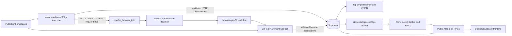

# Newsboard architecture

This document describes the production architecture represented by current code, migrations, workflows, and verified operational notes. Historical reports in `notes/` explain how the system reached this state; older routing descriptions should not override newer migrations and deployment evidence.

## Data flow

## Crawler responsibilities

### Primary Edge crawl

`supabase/functions/newsboard-crawl/index.ts` is invoked privately by Supabase Cron through `pg_net`. It verifies a private token digest, obtains an exclusive run lease, loads routing from `crawler_publishers`, and handles HTTP publishers with bounded concurrency. `collectors.js` rejects non-2xx pages, oversized documents, and empty/invalid centerpiece results. ABC and CBS can additionally extract ranked HTTP coverage from the already parsed page.

Every source attempt is passed to `newsboard_save_source`. Successful validated output appends immutable observations and advances `crawler_current`; failure records only attempt state. `newsboard_finish_run` derives run-level `success`, `partial`, or `failed` from the independent source outcomes.

### Browser gap-fill

All twelve publishers have explicit browser-fallback capability. Database functions in `20260927041509_publisher_fallback_state.sql` maintain a source-specific `crawler_browser_jobs` row. A failed HTTP attempt queues fallback; browser-authoritative sources are queued when due. Pending and running jobs preserve the prior successful observation.

The `newsboard-browser-dispatch` Edge Function uses an atomic database claim and calls the GitHub workflow-dispatch API. `.github/workflows/browser-gap-fill.yml` runs `scripts/crawl/github-browser-gap-fill.mjs`, which claims only due publisher jobs, invokes existing Playwright collectors from `server.js`, and persists each outcome through the same `newsboard_save_source` contract. Per-source retry/backoff and leases prevent one publisher from blocking the rest.

`.github/workflows/scrape.yml` is the manual full-browser backup. It runs all twelve collectors, has no schedule, and never commits generated headline data to the repository.

### Local and legacy tooling

`server.js` remains active for local development, collector implementations, diagnostics, and the browser workers that import its scraper exports. Its local `cache.json` and `archive/` output are runtime/debug artifacts, not the production source of current dashboard data. `scripts/run-scrape.js` still builds retained JSON artifacts for comparison and historical tooling. `wrangler.jsonc` can serve/deploy static `docs/` assets but does not replace Supabase crawler orchestration.

## Persistence and public reads

Important crawler objects:

- `crawler_publishers` — authoritative production method and fallback capability.
- `crawler_runs` / `crawler_source_runs` — run summary and immutable per-source attempt outcomes.
- `crawler_current` — last successful validated observation for each publisher.
- `crawler_snapshots` — successful ordered observation batches.
- `crawler_browser_jobs` and dispatcher tables — source-specific browser work and sanitized status.
- `hero_runs` / `headline_events` — retained observation/event compatibility surfaces.
- `top10_runs`, `top10_items`, `top10_events` — ranked results and changes, with quality gates.

The frontend reads structured anonymous RPCs, principally:

- `newsboard_snapshot()` — current successful publisher state plus separate attempt/fallback health.
- `newsboard_timeline(...)` — bounded observation history.
- `newsboard_top10(...)` — bounded ranked runs and events.
- `newsboard_story_badges()` / `newsboard_story_history(uuid)` — derived Story Intelligence.

Crawler writes, internal job state, credentials, and Story assignment ledgers remain service-role only. `docs/supabase.json` is public client configuration and contains no service-role secret.

## Top 10 and rank changes

Top 10 extraction is publisher-specific and quality-gated. HTTP adapters exist for ABC and CBS. Rendered ranking adapters exist for AP, USA Today, NBC, CNN, The Guardian, and Yahoo; Guardian and Yahoo can legitimately produce partial coverage. LA Times, NPR, BBC, and Fox currently provide homepage-lead coverage only.

Only complete comparable ranked runs create entry, exit, movement, and title-update events. Failed or partial extraction is persisted diagnostically but does not fabricate exits or overwrite a successful centerpiece.

## Story Identity processing

`story-intelligence` runs on a separate schedule and transaction boundary from raw crawling. It consumes successful `story_raw_batches`, uses the deterministic matcher in `matcher.js`, and commits derived assignments through a private idempotent ledger. The worker can fail or retry without rolling back raw observations.

Key derived objects are `stories`, `story_members`, `story_assignments`, `story_processed_batches`, `story_observations`, `story_processing_runs`, and `story_worker_state`. Matching is conservative, time-bounded, and explainable. “First detected” is the earliest Newsboard observation in processed history, never a claim about original publication.

## Frontend loading

GitHub Pages serves `docs/index.html`. On initial load the page fetches the live Supabase snapshot, validates publishers independently, and retries a transient failure once. Continued outages retry automatically. A failed refresh retains only data already rendered in the current session; a fresh outage shows unavailable placeholders.

The page deliberately removes the retired local-storage snapshot and does not load `cache.json` or `docs/data/*.json` as current headlines. Historical JSON remains in the repository for diagnostics and comparison only. Publisher attempt health is rendered separately from observation validity, allowing a last-good headline and a current failure notice to coexist accurately.

## Failure and recovery behavior

- A publisher failure records an attempt but never advances or clears `crawler_current`.
- Run-level partial success does not disguise failed publishers and does not discard successful peers.
- HTTP failure can queue a targeted browser attempt without changing the last-good observation.
- Browser acceptance by GitHub means only that work was queued; success requires persisted publisher output.
- Expired run/job leases become explicit failure states and are retryable.
- Story Intelligence has its own lease and idempotency ledger; raw crawling continues independently.
- Frontend fetch failure cannot revive a frozen repository/local-storage snapshot as current news.

## Publisher registry status

Publisher information is duplicated across `server.js`, Edge HTTP configs, browser adapters, workflow collector maps, frontend display order, and database routing. These copies do not all express the same concept: database method is operational routing, while code registries describe available adapters and fallbacks.

A single registry is desirable, but centralizing it now would couple Deno Edge code, Node/Playwright code, static browser code, and database state. Cleanup Pass 1 therefore leaves behavior unchanged. A future registry should start with a behavior-neutral metadata module (`id`, display name, home URL, adapter availability, ranking capability) plus an automated parity test; database routing must remain separately authoritative.

## Production invariants

Future changes must preserve these properties:

1. **Publisher isolation:** one slow or failed publisher cannot block successful peers or turn their observations into failures.
2. **Last-good retention:** failed, blocked, empty, or invalid output never replaces the last successful publisher observation.
3. **Truthful run semantics:** incomplete publisher coverage is `partial`, not complete success; GitHub dispatch acceptance is not crawl success.
4. **Observation/health separation:** a valid retained headline may be shown alongside the latest attempt state.
5. **Stale-cache avoidance:** fresh page loads use live Supabase reads and never present persisted dashboard/generated snapshots as current.
6. **Automatic recovery:** transient read/crawl failures remain retryable without manual data repair.
7. **Rank quality gates:** incomplete ranked coverage cannot fabricate entry/exit/movement events.
8. **Raw/derived separation:** Story Intelligence cannot mutate or reject raw crawler evidence.
9. **Time semantics:** observation, first detection, promotion, and publication times remain distinct.
10. **Security boundary:** public clients receive read-only newsroom data; crawl tokens, service credentials, internal dispatch data, and derived assignment ledgers stay private.

## Verification boundaries

`npm run verify` covers deterministic collector/ranking/dispatcher/Story matcher tests and browser UI regressions without production writes. SQL files in `supabase/tests/` exercise transactional database invariants and must run in an explicitly rollback-capable environment. Live publisher validation and production smoke tests are separate operational procedures because they depend on network state, publisher markup, credentials, and external rate limits.

See [TESTING.md](TESTING.md) and [FRONTEND_REFACTOR_PLAN.md](FRONTEND_REFACTOR_PLAN.md).
